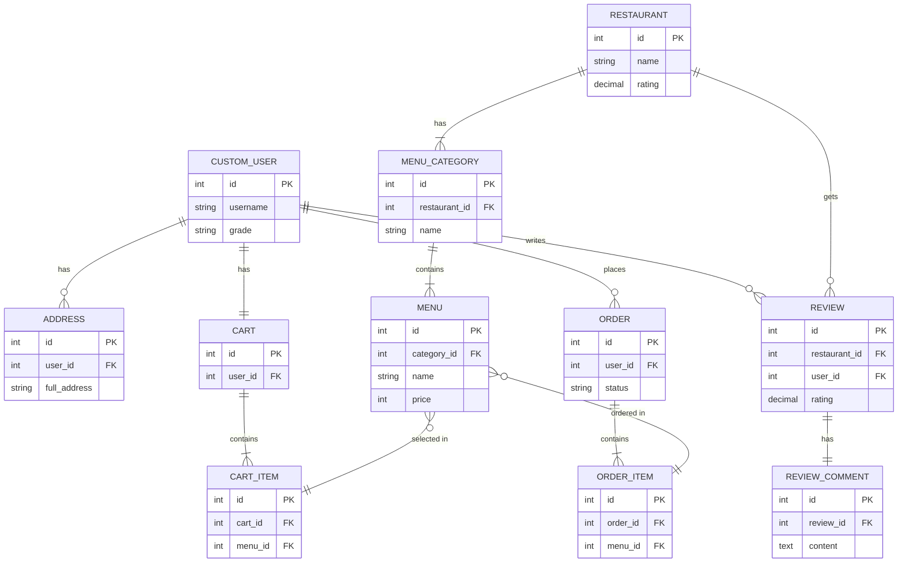
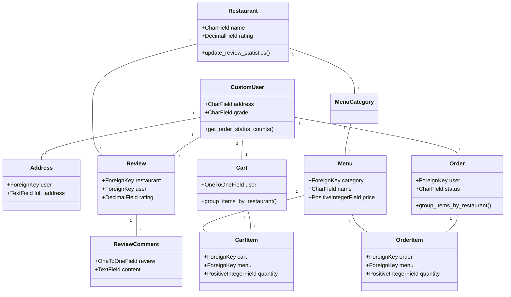
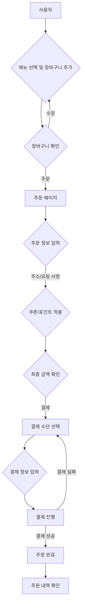
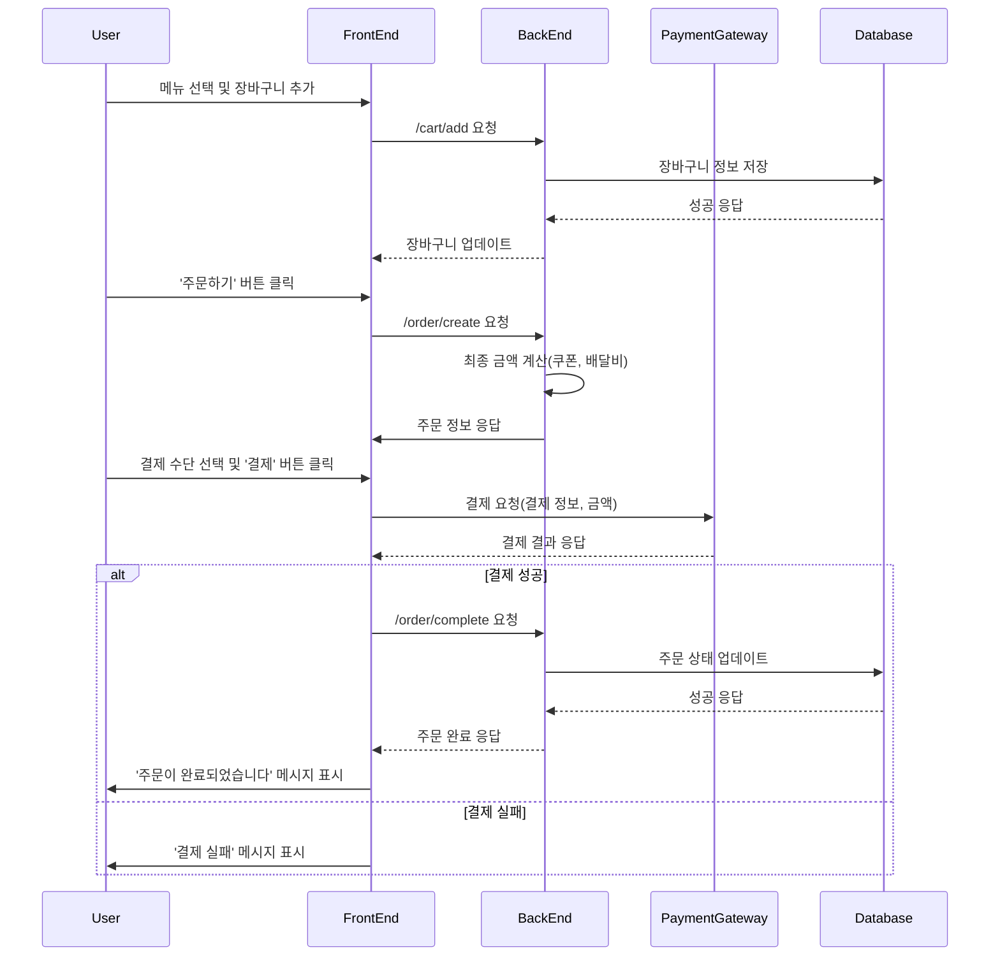

# Sessac Shopping Web Project

이 프로젝트는 Django를 기반으로 한 온라인 음식 주문 및 배달 서비스 웹 애플리케이션입니다.

## 디렉토리 구조

-   `manage.py`: Django 프로젝트의 핵심 관리 스크립트입니다. 서버 실행, 데이터베이스 마이그레이션, 앱 생성 등 다양한 커맨드를 실행하는 데 사용됩니다.
-   `requirements.txt`: 프로젝트에 필요한 Python 패키지들의 목록입니다. `pip install -r requirements.txt` 명령어로 모든 의존성을 한 번에 설치할 수 있습니다.
-   `config/`: 프로젝트의 주 설정 파일이 위치하는 디렉토리입니다.
    -   `settings.py`: 데이터베이스, 설치된 앱, 정적 파일 경로, 미디어 파일 경로 등 프로젝트의 모든 설정을 포함합니다.
    -   `urls.py`: 프로젝트의 최상위 URL 라우팅을 관리합니다. 각 앱의 `urls.py`를 이곳에서 포함(include)합니다.
    -   `wsgi.py` / `asgi.py`: 웹 서버와 Django 애플리케이션을 연결하는 WSGI/ASGI 인터페이스 설정 파일입니다.
-   `apps/`: 프로젝트의 기능별 애플리케이션이 위치하는 메인 디렉토리입니다. 각 앱은 독립적인 기능을 수행하며 MVC(MTV) 패턴에 따라 구성됩니다.
    -   `accounts`: 사용자 계정(회원가입, 로그인) 및 프로필 관리를 담당합니다.
    -   `restaurants`: 가게, 메뉴, 리뷰 등 서비스의 핵심 도메인을 관리합니다.
    -   `orders`: 장바구니, 주문, 결제 로직을 처리합니다.
    -   `mypage`: 로그인한 사용자의 개인화된 페이지(주문 내역, 정보 수정 등)를 담당합니다.
-   `public/`: 정적 파일(`static`) 및 사용자가 업로드하는 미디어 파일(`media`)을 관리하는 디렉토리입니다. 웹 서버(Nginx 등)가 직접 이 디렉토리의 파일들을 서빙하도록 설정할 수 있습니다.
-   `templates/`: 사용자가 보게 될 HTML 파일들이 위치하는 디렉토리입니다. Django 템플릿 언어를 사용하여 동적으로 데이터를 렌더링합니다.

## 전체 ERD (Entity-Relationship Diagram)

프로젝트의 모든 핵심 모델 간의 관계를 나타냅니다.



## 전체 클래스 다이어그램 (Class Diagram)

프로젝트의 주요 클래스(모델)와 그 관계, 주요 메서드를 나타냅니다.



# 파일트리
```
sessac_shoping_web
├─ apps
│  ├─ accounts
│  │  ├─ admin.py
│  │  ├─ apps.py
│  │  ├─ forms.py
│  │  ├─ models.py
│  │  ├─ README.md
│  │  ├─ urls.py
│  │  ├─ views.py
│  │  └─ __init__.py
│  ├─ mypage
│  │  ├─ admin.py
│  │  ├─ apps.py
│  │  ├─ models.py
│  │  ├─ README.md
│  │  ├─ tests.py
│  │  ├─ urls.py
│  │  ├─ views.py
│  │  └─ __init__.py
│  ├─ orders
│  │  ├─ admin.py
│  │  ├─ apps.py
│  │  ├─ models.py
│  │  ├─ README.md
│  │  ├─ services.py
│  │  ├─ tests.py
│  │  ├─ urls.py
│  │  ├─ views.py
│  │  └─ __init__.py
│  ├─ restaurants
│  │  ├─ admin.py
│  │  ├─ apps.py
│  │  ├─ forms.py
│  │  ├─ models.py
│  │  ├─ README.md
│  │  ├─ templatetags
│  │  │  ├─ custom_filters.py
│  │  │  └─ __init__.py
│  │  ├─ tests.py
│  │  ├─ urls.py
│  │  ├─ views.py
│  │  └─ __init__.py
├─ config
│  ├─ asgi.py
│  ├─ settings.py
│  ├─ urls.py
│  ├─ wsgi.py
│  └─ __init__.py
├─ manage.py
├─ public
│  ├─ media
│  │  ├─ restaurants
│  │  │  └─ menu_images
│  │  └─ review_images
│  ├─ static
│  │  ├─ accounts
│  │  │  ├─ icon_bronze.png
│  │  │  ├─ icon_goldpng.png
│  │  │  ├─ icon_platinumpng.png
│  │  │  └─ icon_silverpng.png
│  │  ├─ css
│  │  │  ├─ bootstrap.css
│  │  │  ├─ font-awesome.min.css
│  │  │  ├─ responsive.css
│  │  │  ├─ style.css
│  │  │  ├─ style.css.map
│  │  │  └─ style.scss
│  │  ├─ fonts
│  │  │  ├─ fontawesome-webfont.ttf
│  │  │  ├─ fontawesome-webfont.woff
│  │  │  └─ fontawesome-webfont.woff2
│  │  ├─ images
│  │  │  ├─ favicon.png
│  │  │  └─ hero-bg.jpg
│  │  ├─ js
│  │  │  ├─ bootstrap.js
│  │  │  ├─ custom.js
│  │  │  └─ jquery-3.4.1.min.js
│  │  └─ no_image.jpg
│  └─ __init__.py
├─ README.md
├─ requirements.txt
├─ templates
│  ├─ accounts
│  │  ├─ home.html
│  │  ├─ login.html
│  │  ├─ mypage_orders.html
│  │  ├─ my_review_list.html
│  │  └─ register.html
│  ├─ js
│  │  ├─ cart_widget.js
│  │  ├─ mypage-date-button-state.html
│  │  └─ mypage_review_list.js
│  ├─ main
│  │  ├─ base.html
│  │  ├─ footer.html
│  │  ├─ nav.html
│  │  ├─ post_list.html
│  │  ├─ post_main_detail.html
│  │  └─ widget.html
│  ├─ mypage
│  │  ├─ account_delete.html
│  │  ├─ mypage_base.html
│  │  ├─ mypage_main.html
│  │  ├─ mypage_orders.html
│  │  ├─ my_review_list.html
│  │  ├─ nav.html
│  │  ├─ password_change.html
│  │  ├─ password_change_done.html
│  │  └─ profile_edit.html
│  ├─ orders
│  │  ├─ cart_detail.html
│  │  └─ order_form.html
│  └─ restaurants
│     ├─ order_detail.html
│     ├─ order_list.html
│     ├─ restaurant_detail.html
│     └─ restaurant_list.html
├─ 명세
│  ├─ 기능명세
│  │  ├─ image 1.png
│  │  ├─ image 2.png
│  │  ├─ 가게이미지.png
│  │  ├─ 검색바.png
│  │  ├─ 내비.png
│  │  ├─ 메인_개요.png
│  │  ├─ 배너.png
│  │  ├─ 사이드바.png
│  │  ├─ 전체_리스트.png
│  │  ├─ 카테고리_선택_바.png
│  │  └─ 페이지_선택바.png
│  ├─ 기능명세.md
│  └─ 시스템 아키텍쳐
│     └─ 시스템아키텍쳐.png
└─ 시스템 구성도.md

```

# 결제 순서도


# 결제 시퀀스 다이어그램
