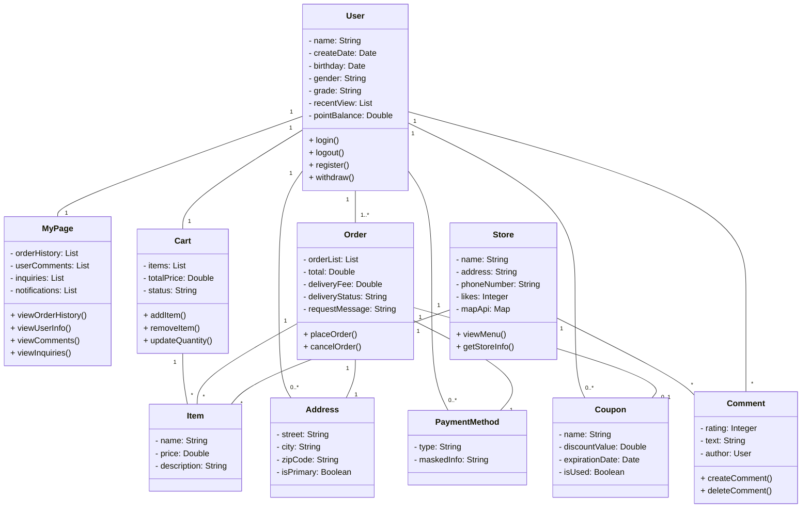
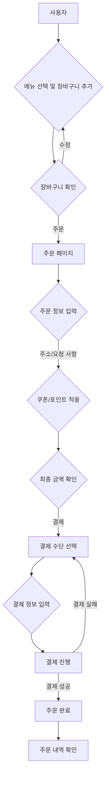
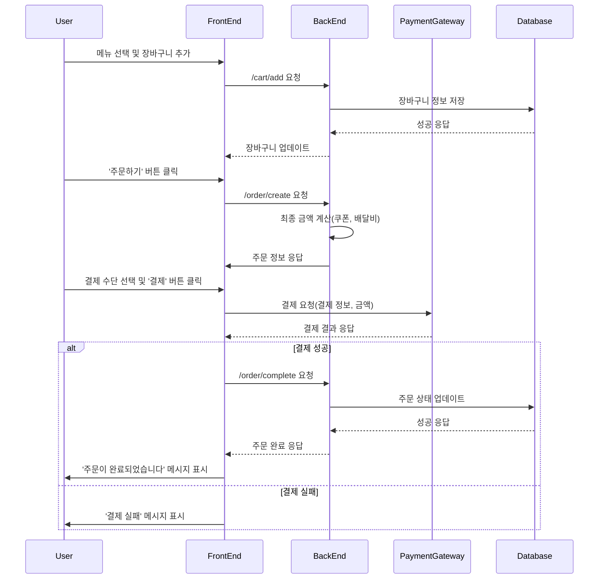
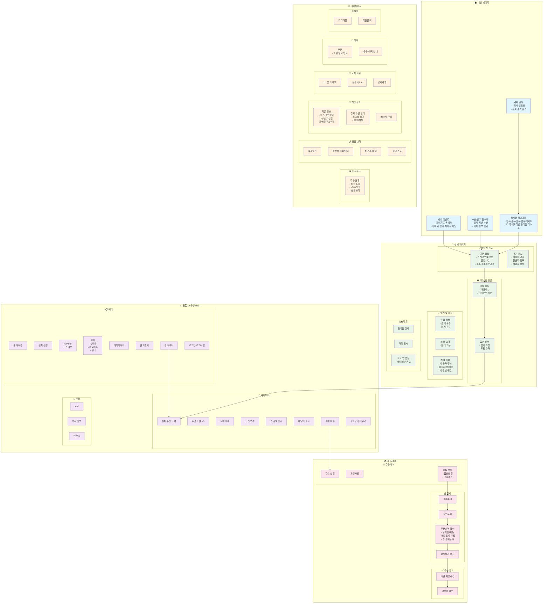

# 파일 트리
## requirements.txt
- pip 패키지 다운로드
```bash
pip install -r requirements.txt
```
## config
- django 상위 페이지

## public
- static/media 폴더

## apps
- 앱 생성 디렉토리

# Class Diagram


# 결제 순서도

순서도 설명:

- 시작: 사용자가 메뉴를 선택합니다.

- 의사 결정: 장바구니에서 메뉴를 수정할지, 바로 주문할지 결정합니다.

- 주문 페이지: 배달 정보와 할인 정보를 입력하는 단계입니다.

- 결제: 결제 수단과 정보를 입력하고 결제를 시도합니다.
 
- 분기점: 결제 성공 여부에 따라 다음 단계가 나뉩니다.
 
- 종료: 결제가 완료되면 주문 내역을 확인할 수 있습니다.

# 결제 시퀀스 다이어그램

시퀀스 다이어그램 설명:

- 메뉴 선택: 사용자가 메뉴를 선택하면 프론트엔드가 백엔드에 장바구니 추가 요청을 보냅니다.
 
- 주문 생성: 주문하기 버튼을 누르면 백엔드에서 최종 금액을 계산하고 주문 정보를 준비합니다.
 
- 결제 요청: 프론트엔드가 결제 게이트웨이에 직접 결제를 요청하고, 그 결과를 받습니다.
 
- 결과 반영: 결제 성공 시, 백엔드에 최종 주문 완료를 알리고 데이터베이스에 상태를 업데이트합니다. 결제 실패 시, 사용자에게 실패 메시지를 바로 보여줍니다.




