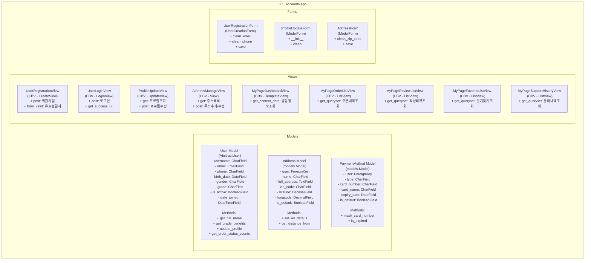

# migrate
- db table 생성
  - accounts models 개별 생성
- 생성 이후 migrate
```bash
python manage.py makemigrations accounts
```

# class 다이아그램


## 🚀 요소별 역할 및 기능

### Models
- **User (`AbstractUser`)**: Django의 기본 User 모델을 확장하여 `phone`, `grade` 등 추가적인 필드를 관리합니다. `AbstractUser`를 상속받아 Django 인증 시스템과 완벽하게 통합됩니다.
- **Address (`models.Model`)**: 사용자의 배송지 정보를 저장합니다. 한 명의 유저는 여러 개의 주소를 가질 수 있습니다 (1:N 관계).
- **PaymentMethod (`models.Model`)**: 사용자가 등록한 결제 수단(카드 정보 등)을 관리합니다. 한 명의 유저는 여러 결제 수단을 등록할 수 있습니다 (1:N 관계).

### Views
- **UserRegistrationView (`CreateView`)**: 신규 사용자 회원가입을 처리합니다. `CreateView`를 상속하고 `UserRegistrationForm`과 연결하여 사용자 생성 로직을 간편하게 구현합니다.
- **UserLoginView (`LoginView`)**: 사용자 로그인을 처리합니다. Django에 내장된 `LoginView`를 사용하여 인증 절차를 안전하고 쉽게 구현할 수 있습니다.
- **ProfileUpdateView (`UpdateView`)**: 로그인한 사용자의 프로필 정보 수정을 담당합니다. `UpdateView`를 상속하여 특정 `User` 객체의 정보를 수정하는 폼을 제공하고 처리합니다.
- **AddressManageView (`View`)**: 사용자의 주소록 관리(조회, 추가, 수정, 삭제)를 한 페이지에서 처리합니다. GET 요청 시 주소 목록과 주소 추가 폼을 보여주고, POST 요청 시 주소 추가/수정/삭제 로직을 수행합니다.
- **MyPageDashboardView (`TemplateView`)**: 마이페이지의 메인 대시보드입니다. 여러 앱의 핵심 정보를 요약하여 보여주는 조정자(Coordinator) 역할을 합니다.
- **MyPage...ListViews (`ListView`)**: 주문 내역, 리뷰, 즐겨찾기 등 각 항목별 목록을 보여주는 페이지들입니다. `ListView`를 상속하여 특정 모델의 데이터 목록을 효율적으로 조회하고 페이지네이션을 구현합니다.

### Forms
- **UserRegistrationForm (`UserCreationForm`)**: `User` 모델 생성을 위한 폼입니다. Django의 `UserCreationForm`을 상속하여 비밀번호 해싱 등 필수적인 보안 처리를 자동화하고, 추가된 커스텀 필드에 대한 유효성 검사를 구현합니다.
- **ProfileUpdateForm (`ModelForm`)**: 프로필 수정을 위한 폼입니다. `ModelForm`을 상속하여 `User` 모델과 직접 연결되며, 민감한 정보를 제외한 필드들의 수정을 처리합니다.
- **AddressForm (`ModelForm`)**: `Address` 모델의 생성 및 수정을 위한 폼입니다. `ModelForm`을 상속하여 모델 필드에 맞는 폼 필드를 자동으로 생성하고 유효성 검사를 수행합니다.

---

## 📖 주요 함수 및 메서드 상세

### Model Methods
- **User.get_full_name**: 사용자의 전체 이름을 반환합니다.
- **User.get_grade_benefits**: 사용자의 등급에 따른 혜택 정보를 반환합니다.
- **User.update_profile**: 프로필 정보를 업데이트하는 로직을 수행합니다.
- **User.get_order_status_counts**: 사용자의 주문 내역을 상태별(예: 주문 대기, 배송 중 등)로 집계하여 각 상태의 개수를 딕셔너리 형태로 반환합니다.
- **Address.set_as_default**: 해당 주소를 기본 배송지로 설정합니다. 기존 기본 배송지는 해제합니다.
- **Address.get_distance_from**: 특정 위치로부터의 거리를 계산하여 반환합니다.
- **PaymentMethod.mask_card_number**: 카드 번호의 일부를 `*`로 마스킹하여 안전하게 표시합니다.
- **PaymentMethod.is_expired**: 카드의 유효기간이 만료되었는지 여부를 boolean 값으로 반환합니다.

### View Methods
- **UserRegistrationView.form_valid**: 폼 유효성 검사가 통과된 후, 사용자를 생성하고 로그인시키는 등 추가적인 로직을 수행합니다.
- **UserLoginView.get_success_url**: 로그인이 성공했을 때 리디렉션할 경로를 반환합니다.
- **ProfileUpdateView.get/post**: GET 요청 시 프로필 수정 폼을, POST 요청 시 정보 수정을 처리합니다.
- **AddressManageView.get/post**: GET 요청 시 주소 목록과 추가 폼을, POST 요청 시 주소 생성/수정/삭제를 처리합니다.
- **MyPageDashboardView.get_context_data**: 대시보드에 필요한 여러 앱의 데이터를 수집하여 템플릿 컨텍스트에 추가합니다.
- **MyPage...ListView.get_queryset**: 각 리스트 뷰에서 현재 로그인한 사용자의 데이터만 필터링하여 조회합니다.

### Form Methods
- **UserRegistrationForm.clean_email**: 이메일 필드에 대한 커스텀 유효성 검사(예: 중복 확인)를 수행합니다.
- **UserRegistrationForm.clean_phone**: 전화번호 필드의 형식을 검증하고 정규화합니다.
- **UserRegistrationForm.save**: 사용자를 생성하고, 커스텀 필드 값을 저장합니다.
- **ProfileUpdateForm.__init__**: 폼 초기화 시, 특정 필드를 비활성화하거나 동적으로 필드를 변경하는 로직을 수행합니다.
- **ProfileUpdateForm.clean**: 여러 필드에 걸친 복합적인 유효성 검사를 수행합니다.
- **AddressForm.clean_zip_code**: 우편번호의 유효성을 검증합니다.
- **AddressForm.save**: 주소 객체를 생성하거나 업데이트합니다.