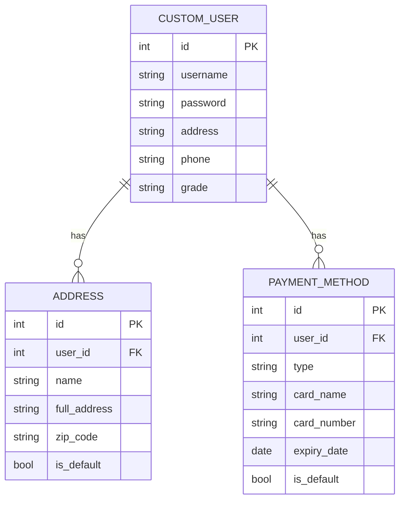
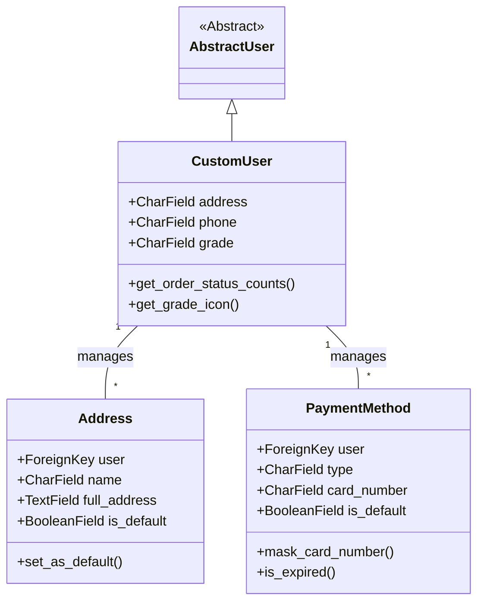
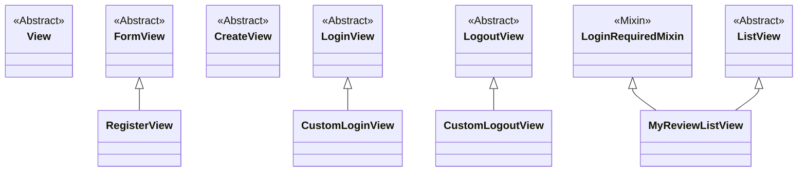

# `accounts` 앱

사용자 계정 및 프로필 관리를 담당하는 앱입니다.

## 주요 기능

-   회원가입, 로그인, 로그아웃
-   사용자 프로필 정보 관리
-   배송지 및 결제 수단 관리
-   사용자가 작성한 리뷰 목록 조회

## ERD (Entity-Relationship Diagram)

## 클래스 다이어그램 (Class Diagram)

## 주요 모델 (Models)

-   `CustomUser`: Django의 `AbstractUser`를 확장한 커스텀 사용자 모델입니다.
    -   **주요 필드**: `address`(주소), `phone`(연락처), `grade`(사용자 등급) 등
-   `Address`: 사용자의 배송지 정보를 저장하는 모델입니다. (기본 배송지 설정 기능 포함)
-   `PaymentMethod`: 사용자의 결제 수단(카드, 계좌)을 관리하는 모델입니다.

## 주요 뷰 (Views)

-   `RegisterView (FormView)`: 사용자 회원가입을 처리합니다.
-   `CustomLoginView (LoginView)`: 로그인을 처리합니다.
-   `CustomLogoutView (LogoutView)`: 로그아웃을 처리합니다.
-   `MyReviewListView (ListView)`: 현재 로그인한 사용자가 작성한 모든 리뷰를 시간순으로 보여줍니다.

## 뷰 클래스 다이어그램 (Views Class Diagram)

