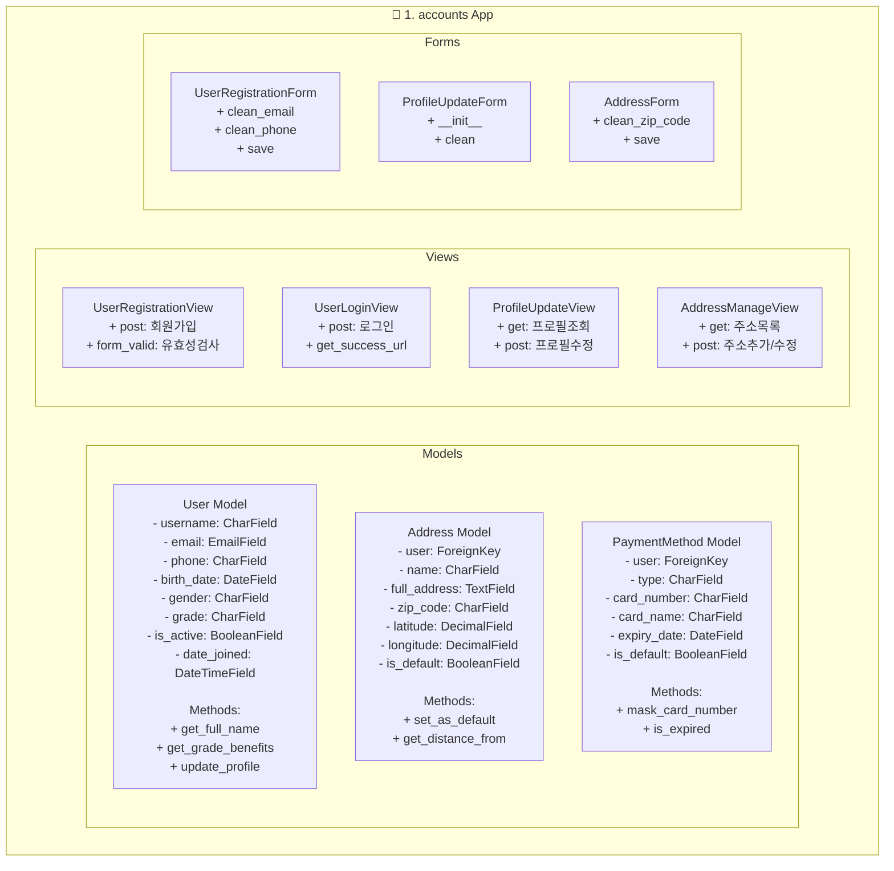

# class 다이아그램

```mermaid
graph TB
    subgraph "📱 1. accounts App"
        subgraph "Models"
            A1[User Model<br/>- username: CharField<br/>- email: EmailField<br/>- phone: CharField<br/>- birth_date: DateField<br/>- gender: CharField<br/>- grade: CharField<br/>- is_active: BooleanField<br/>- date_joined: DateTimeField<br/><br/>Methods:<br/>+ get_full_name<br/>+ get_grade_benefits<br/>+ update_profile]
            A2[Address Model<br/>- user: ForeignKey<br/>- name: CharField<br/>- full_address: TextField<br/>- zip_code: CharField<br/>- latitude: DecimalField<br/>- longitude: DecimalField<br/>- is_default: BooleanField<br/><br/>Methods:<br/>+ set_as_default<br/>+ get_distance_from]
            A3[PaymentMethod Model<br/>- user: ForeignKey<br/>- type: CharField<br/>- card_number: CharField<br/>- card_name: CharField<br/>- expiry_date: DateField<br/>- is_default: BooleanField<br/><br/>Methods:<br/>+ mask_card_number<br/>+ is_expired]
        end
        
        subgraph "Views"
            A4[UserRegistrationView<br/>+ post: 회원가입<br/>+ form_valid: 유효성검사]
            A5[UserLoginView<br/>+ post: 로그인<br/>+ get_success_url]
            A6[ProfileUpdateView<br/>+ get: 프로필조회<br/>+ post: 프로필수정]
            A7[AddressManageView<br/>+ get: 주소목록<br/>+ post: 주소추가/수정]
        end
        
        subgraph "Forms"
            A8[UserRegistrationForm<br/>+ clean_email<br/>+ clean_phone<br/>+ save]
            A9[ProfileUpdateForm<br/>+ __init__<br/>+ clean]
            A10[AddressForm<br/>+ clean_zip_code<br/>+ save]
        end
    end
```