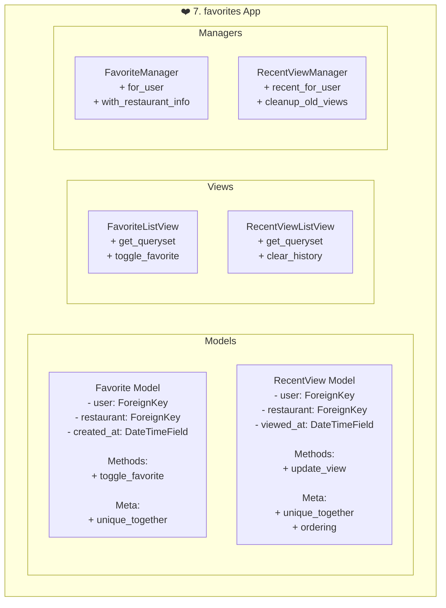

# class 다이아그램

```mermaid
graph TB
    subgraph "❤️ 7. favorites App"
        subgraph "Models"
            G1[Favorite Model<br/>- user: ForeignKey<br/>- restaurant: ForeignKey<br/>- created_at: DateTimeField<br/><br/>Methods:<br/>+ toggle_favorite<br/><br/>Meta:<br/>+ unique_together]
            G2[RecentView Model<br/>- user: ForeignKey<br/>- restaurant: ForeignKey<br/>- viewed_at: DateTimeField<br/><br/>Methods:<br/>+ update_view<br/><br/>Meta:<br/>+ unique_together<br/>+ ordering]
        end
        
        subgraph "Views"
            G3[FavoriteListView<br/>+ get_queryset<br/>+ toggle_favorite]
            G4[RecentViewListView<br/>+ get_queryset<br/>+ clear_history]
        end
        
        subgraph "Managers"
            G5[FavoriteManager<br/>+ for_user<br/>+ with_restaurant_info]
            G6[RecentViewManager<br/>+ recent_for_user<br/>+ cleanup_old_views]
        end
    end
```