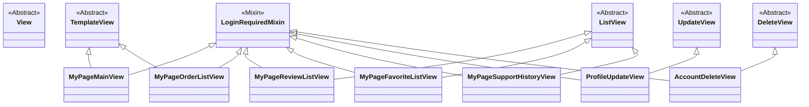

# `mypage` 앱

로그인한 사용자의 개인화된 정보를 조회하고 관리하는 기능을 제공하는 앱입니다. 

**※ 참고:** 이 앱은 자체적인 데이터 모델(`models.py`) 없이, 다른 앱(`accounts`, `orders`, `restaurants` 등)의 데이터를 가져와 사용자 중심으로 보여주는 역할을 합니다. 따라서 ERD와 클래스 다이어그램은 생략합니다.

## 주요 기능

- **마이페이지 대시보드**: 주문 상태, 등급, 포인트, 쿠폰 등 요약 정보 제공
- **주문 내역 조회**: 전체 주문 목록을 기간별(최근 15일, 1개월, 3개월 등)로 필터링하여 조회
- **작성한 리뷰 관리**: 내가 작성한 리뷰 목록을 확인
- **즐겨찾기(찜한 가게) 목록 조회**: 즐겨찾기로 등록한 가게들을 확인
- **고객 지원 내역 조회**: 문의 내역 등을 확인
- **개인 정보 관리**: 개인 정보 수정 및 회원 탈퇴

## 주요 뷰 (Views)

- `MyPageMainView (TemplateView)`: 마이페이지의 메인 대시보드입니다. 사용자의 주문 현황, 등급, 포인트 등의 정보를 요약하여 보여줍니다.
- `MyPageOrderListView (TemplateView)`: 사용자의 전체 주문 내역을 보여줍니다. 기간별로 주문을 필터링하는 기능이 포함되어 있습니다.
- `MyPageReviewListView (ListView)`: 사용자가 작성한 리뷰 목록을 보여줍니다.
- `MyPageFavoriteListView (ListView)`: 사용자가 즐겨찾기한 가게 목록을 보여줍니다. (현재는 임시 데이터 사용)
- `ProfileUpdateView (UpdateView)`: 사용자의 프로필 정보(주소, 연락처 등)를 수정합니다.
- `AccountDeleteView (DeleteView)`: 회원 탈퇴 기능을 처리합니다.

## 뷰 클래스 다이어그램 (Views Class Diagram)

