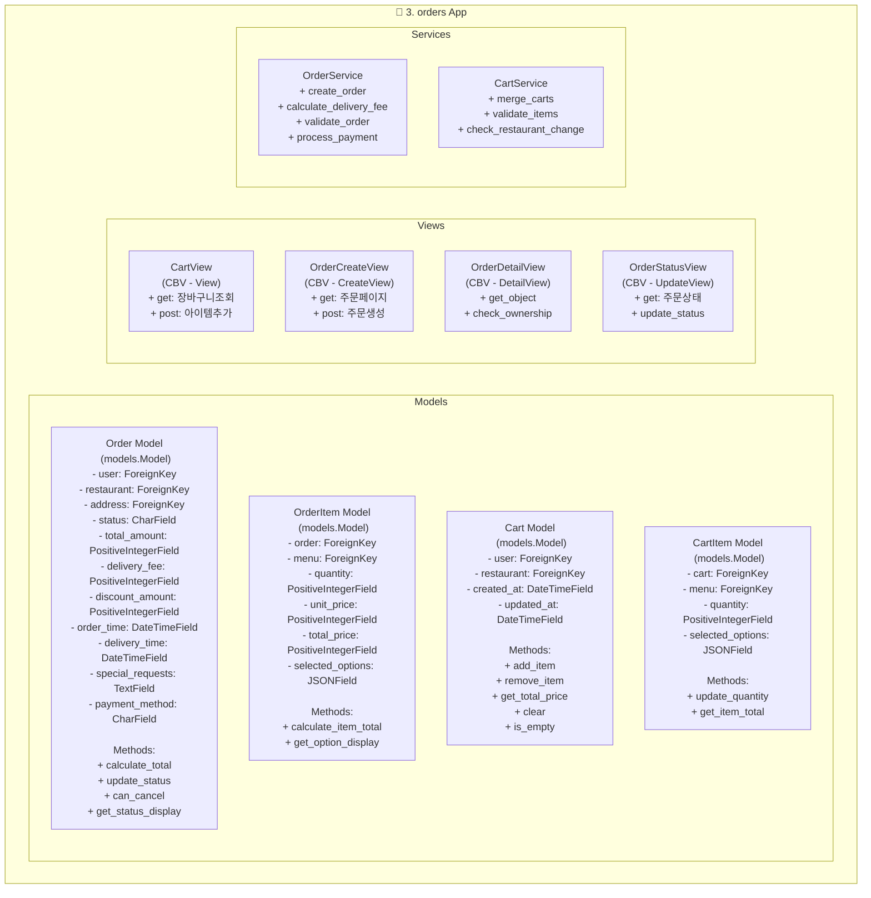

# class 다이아그램

## 🚀 요소별 역할 및 기능

### Models
Django의 `models.Model`을 상속하여 데이터베이스 스키마를 정의합니다. 각 모델은 시스템의 핵심 데이터를 구조화하고, 데이터 간의 관계(1:N, N:M)를 설정하며, 데이터 무결성을 보장하는 역할을 합니다.

- **Cart & CartItem**: 사용자가 주문할 메뉴를 임시로 담아두는 장바구니와 그 안의 항목입니다. `User`와 `Cart`는 1:1 또는 1:N 관계를 가질 수 있으며, `Cart`와 `CartItem`은 1:N 관계입니다. `CartItem`은 `Menu` 모델(restaurants 앱)과 연결되어 상품 정보를 참조합니다.
- **Order & OrderItem**: 사용자의 확정된 주문과 그 상세 내역입니다. `Cart`의 내용을 기반으로 생성되며, `Order`는 주문의 전반적인 정보(배송지, 결제 금액, 주문 상태 등)를, `OrderItem`은 주문된 각 상품의 정보(수량, 가격, 선택 옵션 등)를 저장합니다. `Order`와 `OrderItem`은 1:N 관계입니다.

### Views
사용자의 HTTP 요청(Request)을 받아 비즈니스 로직을 실행하고, 그 결과를 HTTP 응답(Response)으로 반환하는 역할을 합니다. Django의 제네릭 Class-Based Views (CBV)를 상속하여 코드의 재사용성을 높이고 개발 과정을 간소화합니다.

- **CartView (CBV - `View`)**: 장바구니 페이지를 담당합니다. 사용자가 장바구니에 담은 상품 목록을 보여주고(GET), 새로운 상품을 추가(POST)하는 기능을 처리합니다.
- **OrderCreateView (CBV - `CreateView`)**: 장바구니의 상품들을 기반으로 새로운 주문을 생성하는 페이지와 로직을 처리합니다. GET 요청 시 주문서 작성 페이지를 보여주고, POST 요청 시 입력된 정보로 `Order` 객체를 생성합니다.
- **OrderDetailView (CBV - `DetailView`)**: 특정 주문의 상세 내역을 보여주는 페이지입니다. 주문 정보, 주문 상품 목록, 배송 상태 등을 한눈에 볼 수 있습니다.
- **OrderStatusView (CBV - `UpdateView`)**: 주문의 현재 상태를 보여주거나, 상태를 변경하는 로직을 처리합니다. (예: "준비중" -> "배송중")

### Services
View가 너무 많은 역할을 떠안아 비대해지는 것을 방지하기 위해, 복잡한 비즈니스 로직을 별도의 서비스 계층으로 분리합니다. Service는 특정 도메인(주문, 장바구니 등)과 관련된 로직들을 모아놓은 파이썬 클래스입니다. 이를 통해 View는 단순히 요청을 받고 응답을 전달하는 역할에 집중할 수 있으며, 로직의 재사용성과 테스트 용이성이 향상됩니다.

- **OrderService**: 주문 생성, 유효성 검증, 결제 연동, 배달비 계산 등 주문과 관련된 복잡하고 핵심적인 로직들을 처리합니다.
- **CartService**: 여러 장바구니를 하나로 합치거나(예: 비회원 장바구니 -> 회원 장바구니), 장바구니에 담긴 상품의 유효성을 검증하는 등의 로직을 담당합니다.

---

## 📖 주요 함수 및 메서드 상세

### Model Methods
- **Order.calculate_total**: 할인 금액, 배달비를 모두 고려하여 주문의 최종 결제 금액을 계산합니다.
- **Order.update_status**: 주문의 현재 상태를 다음 단계로 변경합니다. (예: 결제완료 -> 상품준비중)
- **Order.can_cancel**: 현재 주문 상태에서 취소가 가능한지 여부를 boolean 값으로 반환합니다.
- **Order.get_status_display**: CharField의 choices 옵션에 설정된 상태값의 표시 이름(예: 'processing' -> '준비중')을 반환합니다.
- **OrderItem.calculate_item_total**: 해당 상품의 단가와 수량을 곱해 합계 금액을 계산합니다.
- **OrderItem.get_option_display**: JSONField에 저장된 선택 옵션들을 사용자가 보기 좋은 형태의 문자열로 변환하여 반환합니다.
- **Cart.add_item**: 장바구니에 새로운 상품을 추가하거나, 이미 있는 상품이라면 수량을 증가시킵니다.
- **Cart.remove_item**: 장바구니에서 특정 상품을 제거합니다.
- **Cart.get_total_price**: 장바구니에 담긴 모든 상품들의 총액을 계산합니다.
- **Cart.clear**: 장바구니의 모든 상품을 삭제합니다.
- **Cart.is_empty**: 장바구니가 비어있는지 여부를 boolean 값으로 반환합니다.
- **CartItem.update_quantity**: 특정 상품의 수량을 변경합니다.
- **CartItem.get_item_total**: 해당 상품의 총액(단가 * 수량)을 반환합니다.

### View Methods
- **CartView.get**: 장바구니 페이지를 렌더링하여 사용자에게 보여줍니다.
- **CartView.post**: 장바구니에 상품을 추가하라는 요청을 받아 처리합니다.
- **OrderCreateView.get**: 주문서 작성 페이지를 렌더링합니다.
- **OrderCreateView.post**: 사용자가 입력한 주문 정보를 받아 새로운 주문을 생성합니다.
- **OrderDetailView.get_object**: 요청 URL에서 pk를 기반으로 특정 `Order` 객체를 조회하여 가져옵니다.
- **OrderDetailView.check_ownership**: 현재 로그인한 사용자가 해당 주문의 소유자인지 확인하여 접근 권한을 제어합니다.
- **OrderStatusView.get**: 현재 주문 상태를 보여주는 페이지를 렌더링합니다.
- **OrderStatusView.update_status**: 주문 상태를 변경하라는 요청을 받아 처리합니다.

### Service Methods
- **OrderService.create_order**: `Cart` 객체와 사용자 정보를 받아 `Order` 및 `OrderItem` 객체들을 생성하는 전체 과정을 담당합니다.
- **OrderService.calculate_delivery_fee**: 주소나 주문 금액에 따라 배달비를 계산하는 로직을 수행합니다.
- **OrderService.validate_order**: 주문 생성 전, 재고나 주문 정보에 문제가 없는지 검증합니다.
- **OrderService.process_payment**: 외부 결제 서비스(PG)와 연동하여 결제를 처리하는 로직을 담당합니다.
- **CartService.merge_carts**: 비회원으로 담아둔 장바구니를 로그인 시점에 회원 장바구니와 합치는 로직을 처리합니다.
- **CartService.validate_items**: 장바구니에 담긴 상품들이 현재 판매 가능한 상태인지(단종, 품절 등) 확인합니다.
- **CartService.check_restaurant_change**: 장바구니에 다른 가게의 메뉴를 담으려고 할 때, 기존 장바구니를 비울지 사용자에게 확인하는 로_logic을 처리합니다.