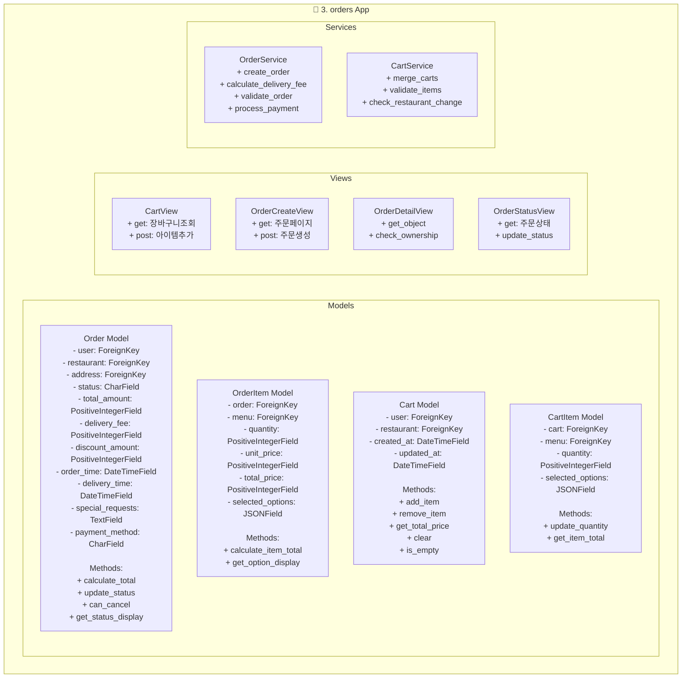

# class 다이아그램

```mermaid
graph TB
    subgraph "🛒 3. orders App"
        subgraph "Models"
            C1[Order Model<br/>- user: ForeignKey<br/>- restaurant: ForeignKey<br/>- address: ForeignKey<br/>- status: CharField<br/>- total_amount: PositiveIntegerField<br/>- delivery_fee: PositiveIntegerField<br/>- discount_amount: PositiveIntegerField<br/>- order_time: DateTimeField<br/>- delivery_time: DateTimeField<br/>- special_requests: TextField<br/>- payment_method: CharField<br/><br/>Methods:<br/>+ calculate_total<br/>+ update_status<br/>+ can_cancel<br/>+ get_status_display]
            C2[OrderItem Model<br/>- order: ForeignKey<br/>- menu: ForeignKey<br/>- quantity: PositiveIntegerField<br/>- unit_price: PositiveIntegerField<br/>- total_price: PositiveIntegerField<br/>- selected_options: JSONField<br/><br/>Methods:<br/>+ calculate_item_total<br/>+ get_option_display]
            C3[Cart Model<br/>- user: ForeignKey<br/>- restaurant: ForeignKey<br/>- created_at: DateTimeField<br/>- updated_at: DateTimeField<br/><br/>Methods:<br/>+ add_item<br/>+ remove_item<br/>+ get_total_price<br/>+ clear<br/>+ is_empty]
            C4[CartItem Model<br/>- cart: ForeignKey<br/>- menu: ForeignKey<br/>- quantity: PositiveIntegerField<br/>- selected_options: JSONField<br/><br/>Methods:<br/>+ update_quantity<br/>+ get_item_total]
        end
        
        subgraph "Views"
            C5[CartView<br/>+ get: 장바구니조회<br/>+ post: 아이템추가]
            C6[OrderCreateView<br/>+ get: 주문페이지<br/>+ post: 주문생성]
            C7[OrderDetailView<br/>+ get_object<br/>+ check_ownership]
            C8[OrderStatusView<br/>+ get: 주문상태<br/>+ update_status]
        end
        
        subgraph "Services"
            C9[OrderService<br/>+ create_order<br/>+ calculate_delivery_fee<br/>+ validate_order<br/>+ process_payment]
            C10[CartService<br/>+ merge_carts<br/>+ validate_items<br/>+ check_restaurant_change]
        end
    end
```