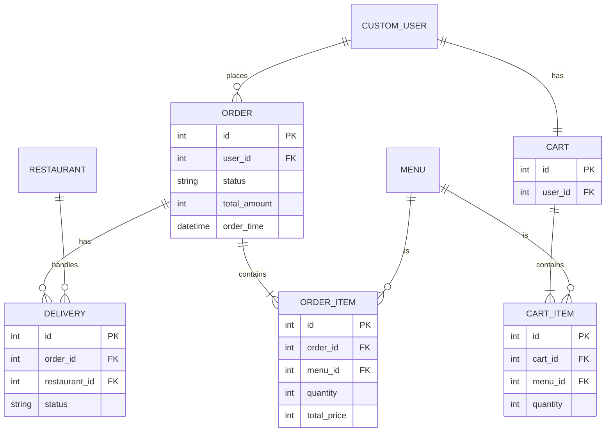
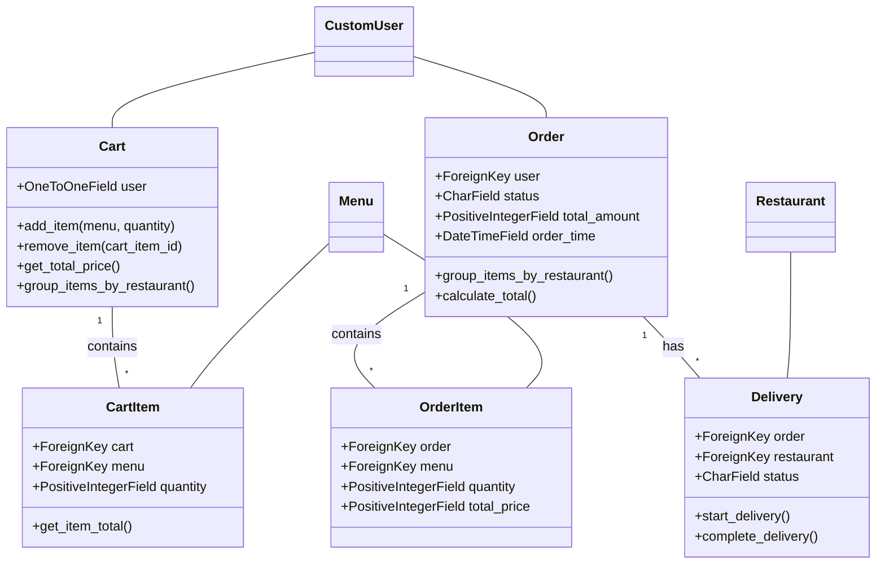

# `orders` 앱

사용자의 장바구니 및 주문 생성/관리를 담당하는 앱입니다. 여러 가게의 메뉴를 하나의 장바구니와 주문에 담을 수 있는 복합적인 기능을 제공합니다.

## 주요 기능

- 여러 가게의 메뉴를 담을 수 있는 장바구니 기능
- AJAX(비동기) 통신을 통한 장바구니 아이템 추가/수정/삭제
- 장바구니에 담긴 상품들을 기반으로 주문 생성
- 주문 내역 관리 및 주문 취소

## ERD (Entity-Relationship Diagram)

## 클래스 다이어그램 (Class Diagram)

## 주요 모델 (Models)

- `Cart`: 사용자의 장바구니 정보를 저장합니다. 여러 가게의 `CartItem`을 포함할 수 있습니다.
- `CartItem`: 장바구니에 담긴 개별 메뉴 항목입니다.
- `Order`: 사용자의 최종 주문 정보입니다. 여러 가게의 `OrderItem`을 포함할 수 있습니다.
- `OrderItem`: 주문에 포함된 개별 메뉴 항목입니다. 주문 시점의 가격이 기록됩니다.
- `Delivery`: 각 가게별 배송 정보를 관리합니다. 하나의 `Order`에 여러 `Delivery`가 생성될 수 있습니다.

## 주요 뷰 (Views)

- `CartView (View)`: 장바구니 페이지를 보여주고, 장바구니에 담긴 데이터를 기반으로 주문을 생성하는 로직을 처리합니다.
- `Cart...APIView` (다수): AJAX 요청을 받아 장바구니 아이템을 추가(`CartAddAPIView`), 수정(`CartUpdateAPIView`), 삭제(`CartRemoveAPIView`)하는 등 비동기 처리를 담당하는 API 뷰들입니다.
- `OrderAPIView (View)`: 서버의 장바구니 정보를 기반으로 최종 주문을 생성하는 API입니다.
- `OrderCancelAPIView (View)`: 특정 주문을 취소 처리하는 API입니다.

## 뷰 클래스 다이어그램 (Views Class Diagram)

```mermaid
classDiagram
    class View {
        <<Abstract>>
    }
    class CreateView {
        <<Abstract>>
    }
    class DetailView {
        <<Abstract>>
    }
    class UpdateView {
        <<Abstract>>
    }
    class DeleteView {
        <<Abstract>>
    }
    class ListView {
        <<Abstract>>
    }
    class LoginRequiredMixin {
        <<Mixin>>
    }

    LoginRequiredMixin <|-- OrderCancelAPIView
    View <|-- OrderCancelAPIView

    LoginRequiredMixin <|-- CartView
    View <|-- CartView

    LoginRequiredMixin <|-- CartDeleteView
    DeleteView <|-- CartDeleteView

    LoginRequiredMixin <|-- OrderCreateView
    CreateView <|-- OrderCreateView

    LoginRequiredMixin <|-- OrderAPIView
    View <|-- OrderAPIView

    LoginRequiredMixin <|-- CartAddAPIView
    View <|-- CartAddAPIView

    LoginRequiredMixin <|-- CartUpdateAPIView
    View <|-- CartUpdateAPIView

    LoginRequiredMixin <|-- CartRemoveAPIView
    View <|-- CartRemoveAPIView

    LoginRequiredMixin <|-- CartDataAPIView
    View <|-- CartDataAPIView

    LoginRequiredMixin <|-- CartClearAPIView
    View <|-- CartClearAPIView

    View <|-- MenuListView

    class OrderCancelAPIView
    class CartView
    class CartDeleteView
    class OrderCreateView
    class OrderAPIView
    class CartAddAPIView
    class CartUpdateAPIView
    class CartRemoveAPIView
    class CartDataAPIView
    class CartClearAPIView
    class MenuListView
```

