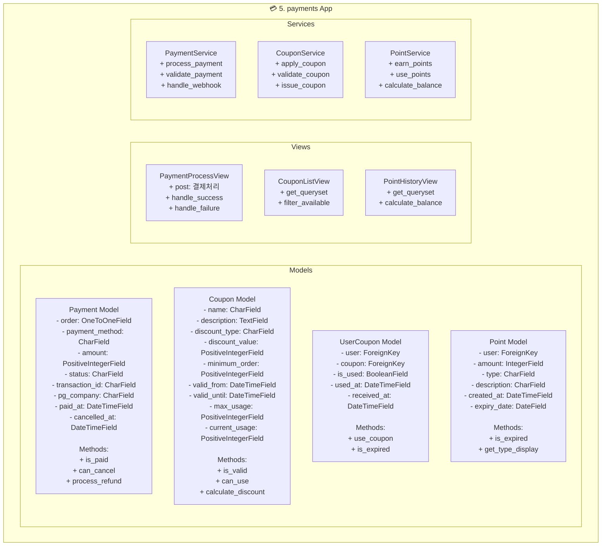

```mermaid
graph TB
    subgraph "💳 5. payments App"
        subgraph "Models"
            E1[Payment Model<br/>- order: OneToOneField<br/>- payment_method: CharField<br/>- amount: PositiveIntegerField<br/>- status: CharField<br/>- transaction_id: CharField<br/>- pg_company: CharField<br/>- paid_at: DateTimeField<br/>- cancelled_at: DateTimeField<br/><br/>Methods:<br/>+ is_paid<br/>+ can_cancel<br/>+ process_refund]
            E2[Coupon Model<br/>- name: CharField<br/>- description: TextField<br/>- discount_type: CharField<br/>- discount_value: PositiveIntegerField<br/>- minimum_order: PositiveIntegerField<br/>- valid_from: DateTimeField<br/>- valid_until: DateTimeField<br/>- max_usage: PositiveIntegerField<br/>- current_usage: PositiveIntegerField<br/><br/>Methods:<br/>+ is_valid<br/>+ can_use<br/>+ calculate_discount]
            E3[UserCoupon Model<br/>- user: ForeignKey<br/>- coupon: ForeignKey<br/>- is_used: BooleanField<br/>- used_at: DateTimeField<br/>- received_at: DateTimeField<br/><br/>Methods:<br/>+ use_coupon<br/>+ is_expired]
            E4[Point Model<br/>- user: ForeignKey<br/>- amount: IntegerField<br/>- type: CharField<br/>- description: CharField<br/>- created_at: DateTimeField<br/>- expiry_date: DateField<br/><br/>Methods:<br/>+ is_expired<br/>+ get_type_display]
        end
        
        subgraph "Views"
            E5[PaymentProcessView<br/>+ post: 결제처리<br/>+ handle_success<br/>+ handle_failure]
            E6[CouponListView<br/>+ get_queryset<br/>+ filter_available]
            E7[PointHistoryView<br/>+ get_queryset<br/>+ calculate_balance]
        end
        
        subgraph "Services"
            E8[PaymentService<br/>+ process_payment<br/>+ validate_payment<br/>+ handle_webhook]
            E9[CouponService<br/>+ apply_coupon<br/>+ validate_coupon<br/>+ issue_coupon]
            E10[PointService<br/>+ earn_points<br/>+ use_points<br/>+ calculate_balance]
        end
    end
```