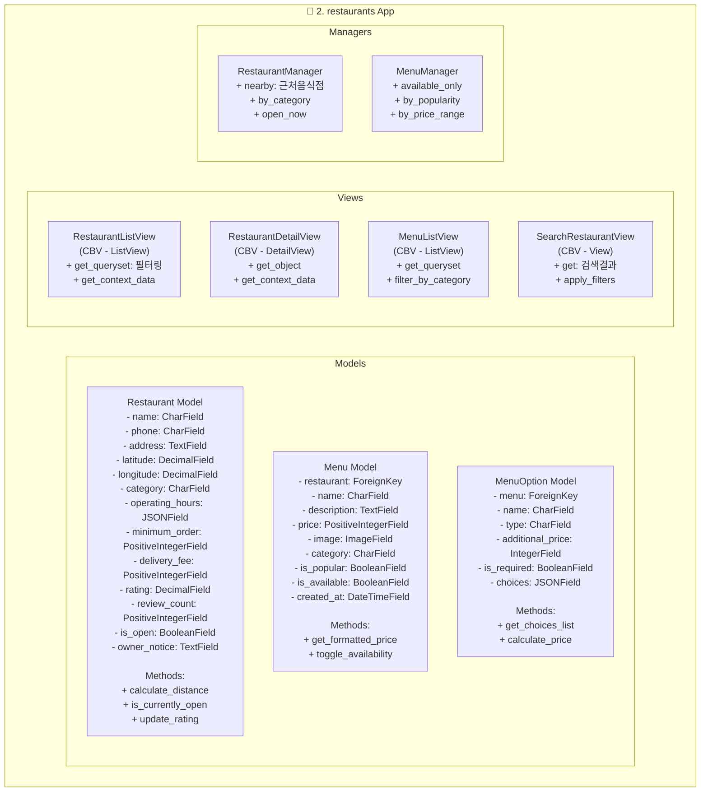

# migrate
- db table 생성
  - restaurants models 개별 생성
- 생성 이후 migrate
```bash
python manage.py makemigrations restaurants
```

# class 다이아그램


## 🚀 요소별 역할 및 기능

### Models
- **Restaurant (`models.Model`)**: 음식점의 기본 정보를 저장하는 핵심 모델입니다. 이름, 주소, 연락처, 영업 시간, 최소 주문 금액, 배달비, 평점 등 음식점 운영에 필요한 모든 정보를 관리합니다.
- **Menu (`models.Model`)**: 각 음식점에서 제공하는 개별 메뉴 항목을 나타냅니다. 메뉴 이름, 설명, 가격, 이미지, 카테고리, 인기 메뉴 여부, 판매 가능 여부 등의 정보를 포함합니다.
- **MenuOption (`models.Model`)**: 메뉴에 대한 추가 옵션(예: 사이즈, 추가 토핑)을 정의합니다. 옵션 이름, 타입, 추가 가격, 필수 선택 여부, 선택지 목록 등을 관리합니다.

### Views
- **RestaurantListView (`ListView`)**: 여러 음식점 목록을 표시하고, 필터링 및 정렬 기능을 제공합니다.
- **RestaurantDetailView (`DetailView`)**: 특정 음식점의 상세 정보를 표시하며, 해당 음식점의 메뉴 목록 등을 함께 보여줍니다.
- **MenuListView (`ListView`)**: 특정 음식점의 메뉴 목록을 표시하며, 카테고리별 필터링 등을 지원합니다.
- **SearchRestaurantView (`View`)**: 사용자의 검색어에 따라 음식점을 검색하고, 검색 결과에 대한 필터링 및 정렬 기능을 제공합니다.

### Managers
- **RestaurantManager (`models.Manager`)**: `Restaurant` 모델에 대한 커스텀 쿼리셋 메서드를 제공합니다. 예를 들어, 특정 위치 근처의 음식점을 찾거나, 카테고리별로 필터링하거나, 현재 영업 중인 음식점을 조회하는 등의 기능을 수행합니다.
- **MenuManager (`models.Manager`)**: `Menu` 모델에 대한 커스텀 쿼리셋 메서드를 제공합니다. 예를 들어, 현재 판매 가능한 메뉴만 조회하거나, 인기순으로 정렬하거나, 가격 범위별로 메뉴를 필터링하는 등의 기능을 수행합니다.

## 📖 주요 함수 및 메서드 상세

### Model Methods
- **Restaurant.calculate_distance**: 주어진 위도/경도와 해당 음식점 간의 거리를 계산하여 반환합니다.
- **Restaurant.is_currently_open**: 현재 시간이 음식점의 영업 시간 내에 포함되는지 여부를 확인하여 반환합니다.
- **Restaurant.update_rating**: 새로운 리뷰가 추가되거나 기존 리뷰가 수정될 때 음식점의 평균 평점과 리뷰 수를 업데이트합니다.
- **Menu.get_formatted_price**: 메뉴 가격을 통화 형식에 맞게 포맷하여 반환합니다.
- **Menu.toggle_availability**: 메뉴의 판매 가능 여부(`is_available`) 상태를 토글합니다.
- **MenuOption.get_choices_list**: `choices` JSON 필드에 저장된 선택지 목록을 파이썬 리스트 형태로 파싱하여 반환합니다.
- **MenuOption.calculate_price**: 선택된 옵션에 따른 최종 가격을 계산하여 반환합니다.

### Manager Methods
- **RestaurantManager.nearby**: 특정 지점(위도, 경도)으로부터 일정 거리 이내에 있는 음식점들을 조회합니다.
- **RestaurantManager.by_category**: 특정 카테고리에 속하는 음식점들을 필터링하여 반환합니다.
- **RestaurantManager.open_now**: 현재 영업 중인 음식점들만 필터링하여 반환합니다.
- **MenuManager.available_only**: 현재 판매 가능한(`is_available=True`) 메뉴 항목들만 필터링하여 반환합니다.
- **MenuManager.by_popularity**: 메뉴 항목들을 인기순(예: 주문 수, 리뷰 수 등)으로 정렬하여 반환합니다.
- **MenuManager.by_price_range**: 특정 가격 범위 내에 있는 메뉴 항목들을 필터링하여 반환합니다.
