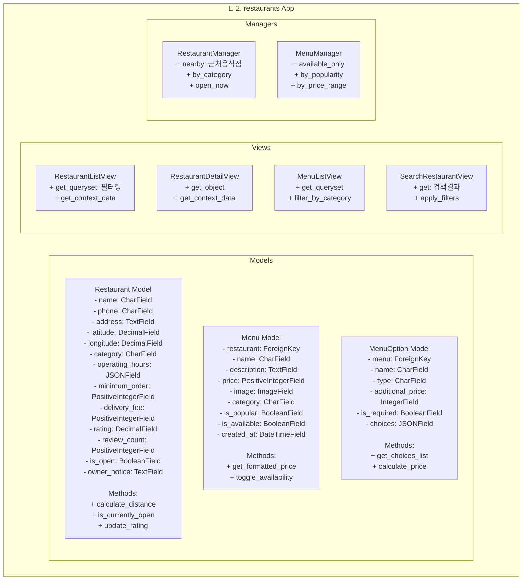

# class 다이아그램

```mermaid
graph TB
    subgraph "🏪 2. restaurants App"
        subgraph "Models"
            B1[Restaurant Model<br/>- name: CharField<br/>- phone: CharField<br/>- address: TextField<br/>- latitude: DecimalField<br/>- longitude: DecimalField<br/>- category: CharField<br/>- operating_hours: JSONField<br/>- minimum_order: PositiveIntegerField<br/>- delivery_fee: PositiveIntegerField<br/>- rating: DecimalField<br/>- review_count: PositiveIntegerField<br/>- is_open: BooleanField<br/>- owner_notice: TextField<br/><br/>Methods:<br/>+ calculate_distance<br/>+ is_currently_open<br/>+ update_rating]
            B2[Menu Model<br/>- restaurant: ForeignKey<br/>- name: CharField<br/>- description: TextField<br/>- price: PositiveIntegerField<br/>- image: ImageField<br/>- category: CharField<br/>- is_popular: BooleanField<br/>- is_available: BooleanField<br/>- created_at: DateTimeField<br/><br/>Methods:<br/>+ get_formatted_price<br/>+ toggle_availability]
            B3[MenuOption Model<br/>- menu: ForeignKey<br/>- name: CharField<br/>- type: CharField<br/>- additional_price: IntegerField<br/>- is_required: BooleanField<br/>- choices: JSONField<br/><br/>Methods:<br/>+ get_choices_list<br/>+ calculate_price]
        end
        
        subgraph "Views"
            B4[RestaurantListView<br/>+ get_queryset: 필터링<br/>+ get_context_data]
            B5[RestaurantDetailView<br/>+ get_object<br/>+ get_context_data]
            B6[MenuListView<br/>+ get_queryset<br/>+ filter_by_category]
            B7[SearchRestaurantView<br/>+ get: 검색결과<br/>+ apply_filters]
        end
        
        subgraph "Managers"
            B8[RestaurantManager<br/>+ nearby: 근처음식점<br/>+ by_category<br/>+ open_now]
            B9[MenuManager<br/>+ available_only<br/>+ by_popularity<br/>+ by_price_range]
        end
    end
```