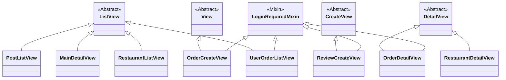

# `restaurants` 앱

가게, 메뉴, 리뷰 등 서비스의 핵심 도메인과 관련된 데이터를 관리하는 앱입니다.

## 주요 기능

- 가게 및 메뉴 정보 관리
- 카테고리별, 검색어별 가게 목록 조회
- 가게 상세 정보(메뉴, 영업 정보, 리뷰) 조회
- 리뷰 및 사장님 댓글 작성/관리

## ERD (Entity-Relationship Diagram)

## 클래스 다이어그램 (Class Diagram)

## 주요 모델 (Models)

- `Restaurant`: 가게의 핵심 정보를 담고 있는 모델입니다. (이름, 주소, 평점, 최소주문금액, 배달비 등)
- `MenuCategory`: 메뉴를 그룹화하는 카테고리 모델입니다. (예: 대표 메뉴, 사이드 메뉴)
- `Menu`: 개별 메뉴의 정보를 관리합니다. `MenuCategory`에 속합니다.
- `Review`: 사용자가 가게에 대해 작성한 리뷰입니다. `Restaurant` 및 `CustomUser`와 연결됩니다.
- `ReviewComment`: 사장님이 `Review`에 대해 작성하는 댓글입니다. `Review`와 1:1 관계를 가집니다.
- `OptionGroup` / `Option`: 메뉴에 대한 선택 옵션(예: 맵기 조절, 사이즈 변경)을 관리합니다.

## 주요 뷰 (Views)

- `PostListView (ListView)`: 메인 페이지에 보여질 가게 목록을 처리합니다. 검색어가 없을 경우 일부 가게만 보여주고, 카테고리별 가게 목록도 함께 제공합니다.
- `MainDetailView (ListView)`: 검색 결과 페이지입니다. 검색어(`q`)를 기반으로 가게를 필터링하여 목록을 보여줍니다.
- `RestaurantDetailView (DetailView)`: 특정 가게의 상세 페이지입니다. 탭(메뉴, 정보, 리뷰) 형식으로 구성되며, 메뉴 정보, 리뷰 목록, 리뷰 작성 폼 등을 제공합니다.
- `ReviewCreateView (CreateView)`: 사용자가 리뷰를 작성하고 저장하는 기능을 처리합니다.
- `comment_create (function-based view)`: 사장님이 리뷰에 대한 댓글을 작성하고 저장하는 기능을 처리합니다.

## 뷰 클래스 다이어그램 (Views Class Diagram)

