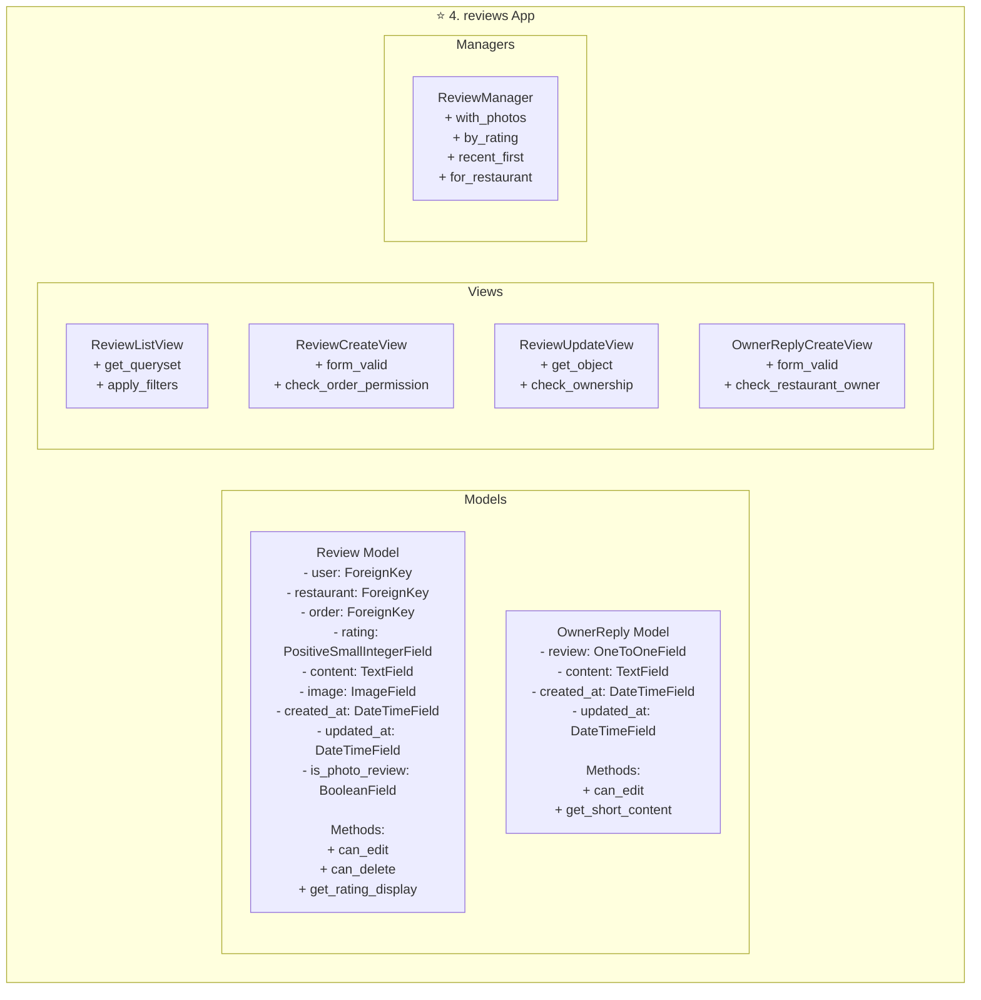

```mermaid
graph TB
    subgraph "⭐ 4. reviews App"
        subgraph "Models"
            D1[Review Model<br/>- user: ForeignKey<br/>- restaurant: ForeignKey<br/>- order: ForeignKey<br/>- rating: PositiveSmallIntegerField<br/>- content: TextField<br/>- image: ImageField<br/>- created_at: DateTimeField<br/>- updated_at: DateTimeField<br/>- is_photo_review: BooleanField<br/><br/>Methods:<br/>+ can_edit<br/>+ can_delete<br/>+ get_rating_display]
            D2[OwnerReply Model<br/>- review: OneToOneField<br/>- content: TextField<br/>- created_at: DateTimeField<br/>- updated_at: DateTimeField<br/><br/>Methods:<br/>+ can_edit<br/>+ get_short_content]
        end
        
        subgraph "Views"
            D3[ReviewListView<br/>+ get_queryset<br/>+ apply_filters]
            D4[ReviewCreateView<br/>+ form_valid<br/>+ check_order_permission]
            D5[ReviewUpdateView<br/>+ get_object<br/>+ check_ownership]
            D6[OwnerReplyCreateView<br/>+ form_valid<br/>+ check_restaurant_owner]
        end

                subgraph "Managers"
            D7[ReviewManager<br/>+ with_photos<br/>+ by_rating<br/>+ recent_first<br/>+ for_restaurant]
        end
    end
```