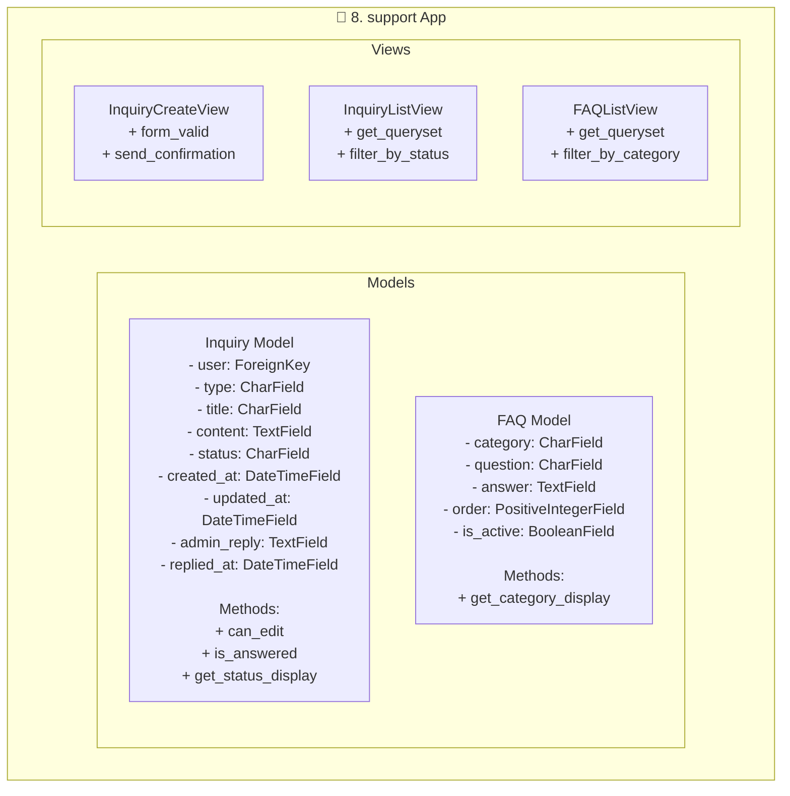

```mermaid
graph TB
    subgraph "💬 8. support App"
        subgraph "Models"
            H1[Inquiry Model<br/>- user: ForeignKey<br/>- type: CharField<br/>- title: CharField<br/>- content: TextField<br/>- status: CharField<br/>- created_at: DateTimeField<br/>- updated_at: DateTimeField<br/>- admin_reply: TextField<br/>- replied_at: DateTimeField<br/><br/>Methods:<br/>+ can_edit<br/>+ is_answered<br/>+ get_status_display]
            H2[FAQ Model<br/>- category: CharField<br/>- question: CharField<br/>- answer: TextField<br/>- order: PositiveIntegerField<br/>- is_active: BooleanField<br/><br/>Methods:<br/>+ get_category_display]
        end
        
        subgraph "Views"
            H3[InquiryCreateView<br/>+ form_valid<br/>+ send_confirmation]
            H4[InquiryListView<br/>+ get_queryset<br/>+ filter_by_status]
            H5[FAQListView<br/>+ get_queryset<br/>+ filter_by_category]
        end
    end
```