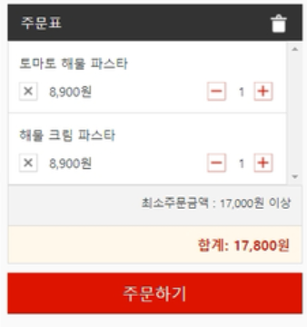
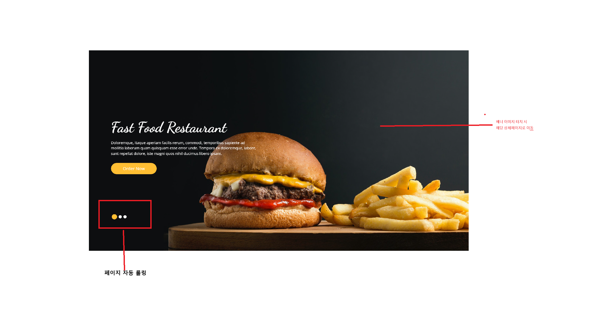
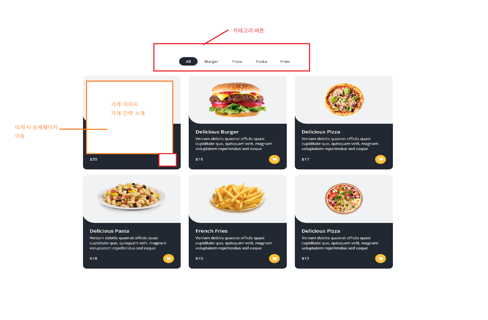
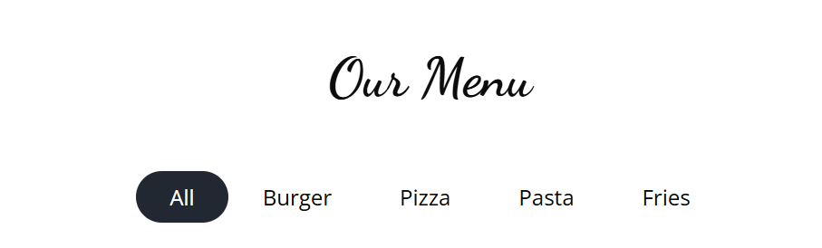
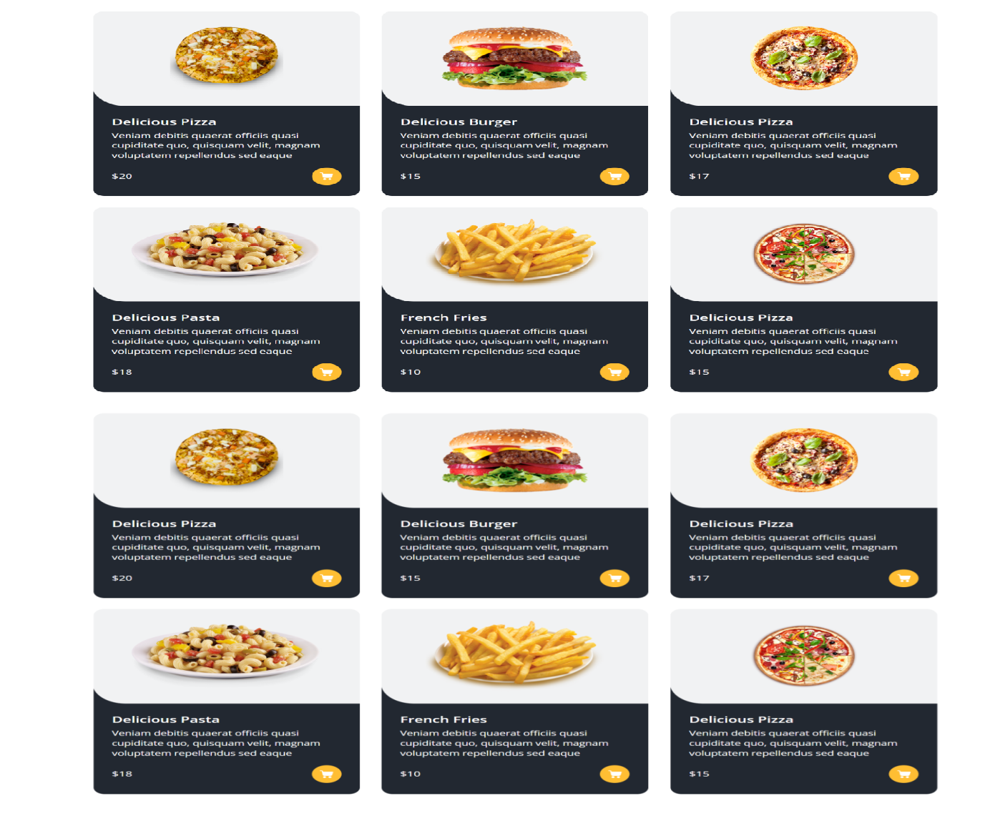

# 기능 명세

# 공통

# 헤더

- 홈 아이콘
- 위치 설정
- nav bar (드롭다운?)
    
    
    
    - 한식
    - 일식
    - 중식
    - 양식
- 검색
    - 입력창
    - 완료 버튼
    - 필터
- 마이페이지
- 즐겨찾기
- 장바구니
- 로그인/로그아웃

# 사이드바

- 장바구니
    - 현재 주문 목록
    - 수량 조절 (+/- 버튼)
    - 삭제 버튼
    - 옵션 변경
    - 총 금액 표시
    - 배달비 표시
    - 결제 버튼
    - 장바구니 비우기

# 푸터

- 로고
- 회사 이름
- 주소
- 메일
- 고객센터 번호

---

# 메인

- **배너 이벤트**
    - 이미지 자동 롤링
    - 이미지 터치 시 해당 상세 페이지로 이동

- **추천/인기 음식점**: 사용자 위치 기반 추천 및 인기 음식점 리스트
    
    
    
    - 가게 대표 이미지
        - 대표 이미지 터치 시 상세 페이지로 이동
    - 가게 이름
        - 이름 터치 시 상세 페이지로 이동
    - 금액
        - 금액 터치 시 상세 페이지로 이동
    - [장바구니/주문하기] 버튼
        - 장바구니/ 주문하기 터치 시 장바구니로 이동 및 해당 음식 추가

- **가게 검색 기능**
    - 검색 입력창
    - placeholder ‘가게 검색어 입력하세요’
    - [검색] 버튼 터치 시 하단 카테고리 영역에 해당 가게만 출력

- **음식점 카테고리**:
    - 한식
    - 중식
    - 일식
    - 양식
    - 디저트
    
    - 카테고리당 메인 화면에 몇개씩 보여줄것인지 확인 필요

- **카테고리 하단 음식점 정보 :**
    - 가게 대표 이미지
    - 가게 명
    - 가게 요약 내용
    - 해당 이미지 터치 시 상세 페이지로 이동

- 메인 상세페이지
    - 카테고리 명
    - 카테고리 버튼
    
    
    
    - 카테고리별 메인 상세 페이지
    
    
    
    - 하단 페이지네이션
        
        
        

- 추후 (시간적으로 여유가 있을 시)
    - 포장, B마트 항목 추가

---

# 상세페이지

### 공통

- 카테고리
- 사이드바(장바구니)
    - 상단 아이콘
    - 하단 플로팅 버튼

### 상세

- 음식점 정보
    - 기본정보
        - 가게명
        - 운영시간(운영 상태)
        - 주소
        - 최소 주문 금액, 배달 팁
    - 추가정보
        - 사장님 공지
        - 원산지 정보
        
- 메뉴 및 옵션
    - 메뉴
        - 메뉴 종류 (대표메뉴, 인기순, 가격순)
        - 사진
        - 가격
    - 옵션 선택
        - 맵기 조절, 토핑 추가
        
- 별점 및 리뷰
    - 종합 평점
        - 총 리뷰 수 와 평점 평균 값 시각화
    - 리뷰 요약
        - 필터 (사진 리뷰만 보기, 최신순, 별점 높은 순)
    - 개별 리뷰
        - 사용자 프로필
        - 별점 및 내용
        - 사진
        - 사장님 댓글
        
- 지도
    - 음식점 위치
    - 내 위치와의 거리
    - 지도 앱 연동
        - 네이버 지도, 카카오 지도 연동

---

# **5. 마이페이지**

## 대시보드

- 주문 현황
    - 배송 조회
    - 교환/반품 신청
    - 목록 검색
    - 상세보기

## 활동 내역

- 즐겨 찾기
- 작성한 리뷰/댓글
- 최근 본 내역
    - 상세보기
- 찜 리스트
    - 상세보기

## 개인 정보

- 기본 정보
    - 이름
    - 생년월일
    - 성별
    - 가입일
    - 이메일
    - 등급(UI)
    - 전화번호
    - 결제 수단 관리
        - 리스트 보기
        - 수정/삭제
    - 배송지 관리

## 고객 지원

- 1:1 문의 내역
- 상품 Q&A 내역
- 공지사항

## 혜택

- 쿠폰
    - 보유 쿠폰
    - 완료/만료 쿠폰
- 등급 혜택 안내

## 설정

- 로그아웃
- 회원탈퇴

# 주문/결제

# 주소

## 주문시 요청사항

### 메뉴 상세사항

- **옵션변경**
- **갯수추가**
    - 메뉴추가
- **결제수단**
- **할인쿠폰**

---

## 고정: 주문내역

- 음식점
- 주
- 메뉴
- 배달료
- 할인료
- 총 결제 금액
- **[결제하기]**

# 주문 후

배달 예상 시간

영수증 확인